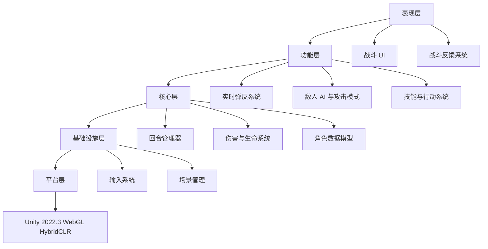
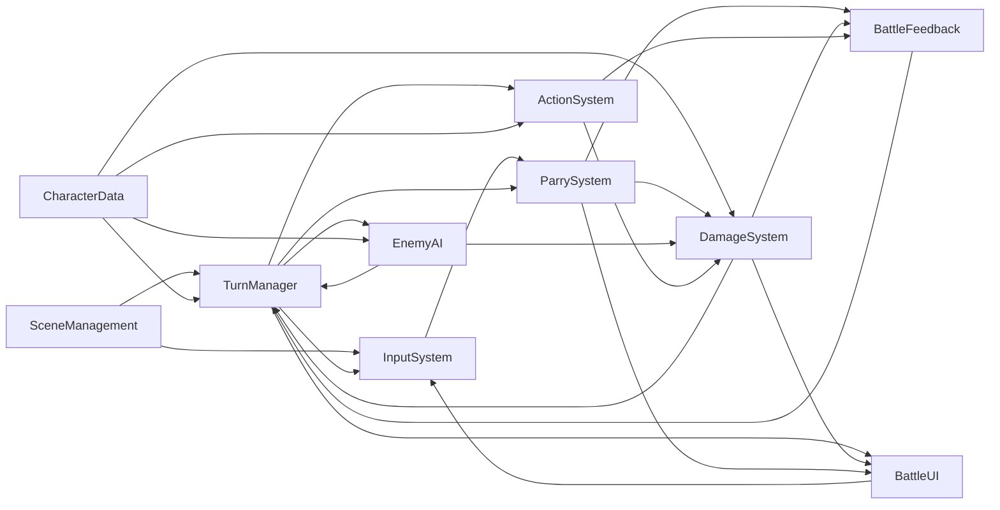
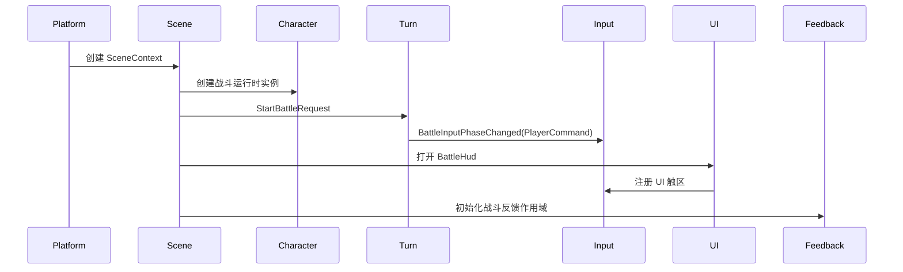
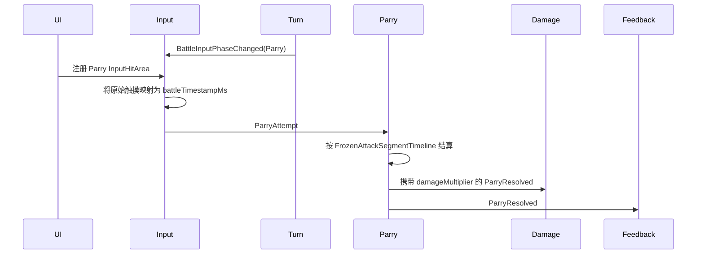
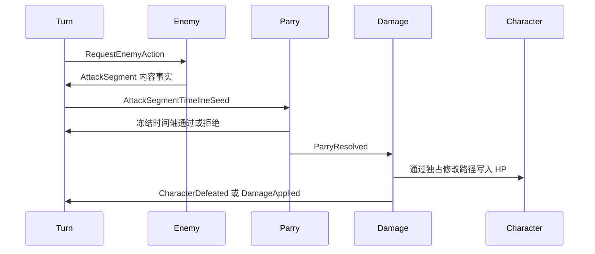
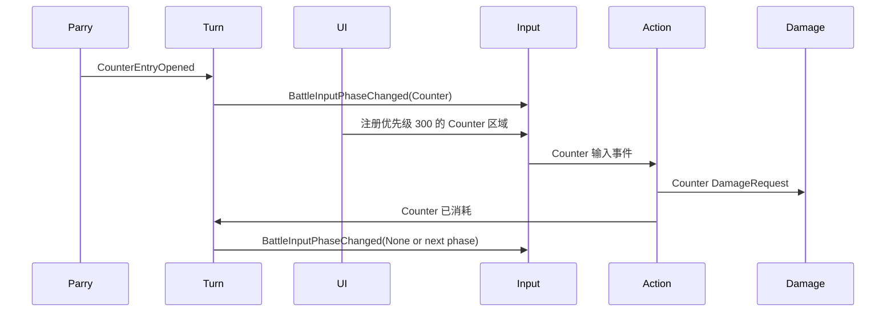
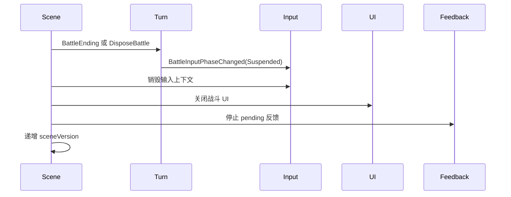

# 回响之刃 — 主架构文档

## 文档状态

- 版本：0.1
- 最后更新：2026-04-29
- 引擎：Unity 2022.3.17f1
- 目标平台：微信小游戏 / WebGL WASM
- 架构范围：MVP 实现蓝图
- 覆盖 GDD：
  - `design/gdd/game-concept.md`
  - `design/gdd/systems-index.md`
  - `design/gdd/角色数据模型.md`
  - `design/gdd/输入系统.md`
  - `design/gdd/场景管理.md`
  - `design/gdd/回合管理器.md`
  - `design/gdd/伤害与生命系统.md`
  - `design/gdd/实时弹反系统.md`
  - `design/gdd/敌人 AI 与攻击模式.md`
  - `design/gdd/技能与行动系统.md`
  - `design/gdd/战斗反馈系统.md`
  - `design/gdd/战斗 UI.md`
- 引用 ADR：
  - `docs/architecture/adr-0001-scene-lifecycle-context-routing.md`
  - `docs/architecture/adr-0002-battle-event-bus-dto-versioning.md`
  - `docs/architecture/adr-0003-gameplay-unity-hybridclr-layering.md`
  - `docs/architecture/adr-0004-combat-clock-deterministic-ordering.md`
  - `docs/architecture/adr-0005-damage-hp-ownership.md`
  - `docs/architecture/adr-0006-mobile-touch-timestamp-hit-area-strategy.md`
  - `docs/architecture/adr-0007-parry-timeline-counter-handoff.md`
  - `docs/architecture/adr-0008-enemy-attack-pattern-ownership.md`
  - `docs/architecture/adr-0009-battle-feedback-quality-hitstop.md`
  - `docs/architecture/adr-0010-uiframe-battle-hud-composition.md`
  - `docs/architecture/adr-0011-character-schema-snapshot-ownership.md`
  - `docs/architecture/adr-0012-action-service-boundary.md`
  - `docs/architecture/adr-0013-deterministic-combat-test-strategy.md`
- 技术总监签署：待完成
- 主程可行性评审：`LP-FEASIBILITY` 已跳过 — Lean 模式

## 引擎知识缺口摘要

Unity 2022.3.17f1 位于当前文档记录的 LLM 知识覆盖窗口内，并在 `docs/engine-reference/unity/VERSION.md` 中标记为低风险。项目真正的架构风险不在 Unity 基础版本，而在平台形态：WebGL WASM、微信小游戏包体与运行环境、纯触屏输入、无多线程、内存受限，以及 HybridCLR / AOT 边界。

本地缺失的引擎参考文件：


| 参考文件                                                    | 状态  | 架构影响                                               |
| ------------------------------------------------------- | --- | -------------------------------------------------- |
| `docs/engine-reference/unity/breaking-changes.md`       | 缺失  | 任何引用引擎或包行为的 ADR，在接受前都必须通过外部 Unity 文档或项目验证补证        |
| `docs/engine-reference/unity/deprecated-apis.md`        | 缺失  | 当前架构无法证明后续方案没有引用已弃用 Unity API                      |
| `docs/engine-reference/unity/current-best-practices.md` | 缺失  | 实现指导应保持保守，优先遵循项目现有模式                               |
| `docs/engine-reference/unity/modules/`                  | 缺失  | 领域 API 决策需后续验证，尤其是 UI、WebGL、Addressables、HybridCLR |


ADR 中必须标记的风险域：


| 领域                  | 风险  | 原因                         | 架构应对                                     |
| ------------------- | --- | -------------------------- | ---------------------------------------- |
| 微信 WebGL 输入时序       | 高   | 核心机制依赖触摸时间戳和低延迟反馈          | 将平台时间戳映射隔离在输入适配层；弹反判定只使用 `CombatClockMs` |
| HybridCLR / AOT 分层  | 高   | 运行时代码和元数据边界会让单纯 Unity 架构失效 | 玩法域逻辑保持纯 C# 契约；Unity 层只做适配和表现            |
| WebGL 性能 / 内存       | 高   | VFX、UI、hit stop 不得制造帧尖峰    | 表现层必须有质量分级，且不能影响战斗结果                     |
| URP 移动端表现           | 中   | Art Bible 要求在严格预算内呈现强弹反峰值  | 反馈 profile 必须按质量层降级                      |
| Addressables / 资源加载 | 中   | 资源策略会影响 UI、VFX 和场景加载       | 延后到 ADR；MVP 架构只要求异步资源边界                  |
| 标准 C# 领域逻辑          | 低   | 纯逻辑可由训练知识与本地代码模式覆盖         | 优先采用确定性、可单元测试的服务                         |


## 技术需求基线

以下需求提取自 10 个已批准的 MVP GDD 和游戏概念文档，并按架构领域归类。当前尚无 ADR，因此完整 ADR 追踪仍是待补缺口。


| Req ID         | GDD          | 系统      | 需求                                                                      | 领域  |
| -------------- | ------------ | ------- | ----------------------------------------------------------------------- | --- |
| TR-concept-001 | game-concept | 产品      | 支持“回合制 RPG + 敌方攻击中嵌入实时弹反”的核心循环                                          | 战斗  |
| TR-concept-002 | game-concept | 表现      | 表现层必须放大精准操作的快感，但不得成为规则事实来源                                              | 表现  |
| TR-char-001    | 角色数据模型       | 角色数据    | 所有跨系统角色引用使用稳定 gameplay id                                               | 状态  |
| TR-char-002    | 角色数据模型       | 角色数据    | 区分静态定义、运行时实例和不可变快照                                                      | 状态  |
| TR-char-003    | 角色数据模型       | 角色数据    | 提供 `CanAct`、`CanBeTargeted`、`CanReceiveDamage`、`IsControllable` 等独立查询标记 | 战斗  |
| TR-char-004    | 角色数据模型       | 角色数据    | 角色被击败后保留实例，直到战斗或场景清理显式移除                                                | 状态  |
| TR-input-001   | 输入系统         | 输入      | 战斗输入来自 Touch / PointerDown，不使用 UGUI click 合成事件做判定源                      | 输入  |
| TR-input-002   | 输入系统         | 输入      | 输出结构化 `ParryAttempt`，并携带时间戳诊断信息                                         | 输入  |
| TR-input-003   | 输入系统         | 输入      | 将平台时间戳映射到 `CombatClockMs`，并标记 fallback 来源                               | 时序  |
| TR-input-004   | 输入系统         | 输入      | 拥有触区注册、优先级、遮挡和重复输入过滤                                                    | 输入  |
| TR-scene-001   | 场景管理         | 场景      | 拥有 `SceneContext`、`sceneContextId` 和 `sceneVersion`                     | 状态  |
| TR-scene-002   | 场景管理         | 场景      | 场景切换期间冻结战斗输入并拒绝迟到事件                                                     | 事件  |
| TR-scene-003   | 场景管理         | 场景      | 在战斗场景生命周期内创建和销毁战斗临时运行态                                                  | 状态  |
| TR-turn-001    | 回合管理器        | 回合管理    | 拥有 `CombatClockMs` 和战斗阶段状态                                              | 时序  |
| TR-turn-002    | 回合管理器        | 回合管理    | 发布显式 `BattleInputPhaseChanged` 事件                                       | 输入  |
| TR-turn-003    | 回合管理器        | 回合管理    | 调度敌方攻击段并分配时间轴序列身份                                                       | 战斗  |
| TR-turn-004    | 回合管理器        | 回合管理    | 将 `CounterWindow` 作为一等战斗状态                                              | 战斗  |
| TR-turn-005    | 回合管理器        | 回合管理    | 只读取角色生命状态判定胜负，绝不写 HP                                                    | 战斗  |
| TR-dmg-001     | 伤害与生命系统      | 伤害 / HP | 作为唯一 HP 写入口                                                             | 状态  |
| TR-dmg-002     | 伤害与生命系统      | 伤害 / HP | 消费具备幂等键的 `DamageRequest`                                                | 战斗  |
| TR-dmg-003     | 伤害与生命系统      | 伤害 / HP | 精确应用弹反 `damageMultiplier`                                               | 战斗  |
| TR-dmg-004     | 伤害与生命系统      | 伤害 / HP | 发出 `DamageApplied`、`DamageRejected` 和 `CharacterDefeated`               | 事件  |
| TR-parry-001   | 实时弹反系统       | 弹反      | 从 `AttackSegmentTimelineSeed` 派生并冻结弹反窗口                                 | 时序  |
| TR-parry-002   | 实时弹反系统       | 弹反      | 用 `CombatClockMs` 而不是 Unity 帧时间结算 `ParryAttempt`                        | 时序  |
| TR-parry-003   | 实时弹反系统       | 弹反      | 发出 `ParryResolved`、`ParryCancelled`、`OverlapRejected` 和时间轴拒绝事件          | 事件  |
| TR-parry-004   | 实时弹反系统       | 弹反      | 只由 `PerfectParry` 打开 counter，且不直接写 HP                                   | 战斗  |
| TR-enemy-001   | 敌人 AI 与攻击模式  | 敌人 AI   | 按权重、冷却、HP 阶段和目标合法性选择脚本化攻击模式                                             | 战斗  |
| TR-enemy-002   | 敌人 AI 与攻击模式  | 敌人 AI   | 拥有基础伤害、读招时序、连击规则等攻击内容事实                                                 | 战斗  |
| TR-enemy-003   | 敌人 AI 与攻击模式  | 敌人 AI   | 响应弹反、取消、重叠和 counter 事件，不得把被拒绝攻击转为必中                                     | 事件  |
| TR-action-001  | 技能与行动系统      | 行动      | MVP 只支持 `BasicAttackAction` 和 `CounterAction`                           | 战斗  |
| TR-action-002  | 技能与行动系统      | 行动      | 通过 `DamageRequest` 提交伤害，并保持行动请求幂等                                       | 战斗  |
| TR-action-003  | 技能与行动系统      | 行动      | 只有收到 `CounterEntryOpened` 授权后才能执行 counter                               | 战斗  |
| TR-fx-001      | 战斗反馈系统       | 反馈      | 只消费事件，绝不修改战斗事实                                                          | 表现  |
| TR-fx-002      | 战斗反馈系统       | 反馈      | 发起 hit stop 请求，由回合管理器控制 `CombatClockMs`                                 | 时序  |
| TR-fx-003      | 战斗反馈系统       | 反馈      | VFX 和震动可按性能等级降级，但不得改变结果                                                 | 平台  |
| TR-ui-001      | 战斗 UI        | 战斗 UI   | 从事件和快照渲染状态，不直接读取可变玩法对象                                                  | UI  |
| TR-ui-002      | 战斗 UI        | 战斗 UI   | 通过输入系统注册触区，counter 优先级高于 parry                                          | 输入  |
| TR-ui-003      | 战斗 UI        | 战斗 UI   | 不显示精确弹反倒计时；时机可读性来自敌人与反馈 cue                                             | UI  |


## 系统分层图




| 层级    | 系统                                                 | 职责                            |
| ----- | -------------------------------------------------- | ----------------------------- |
| 平台层   | Unity 2022.3, WebGL WASM, WeChat bridge, HybridCLR | 引擎运行时、平台输入、渲染、资源加载、AOT / 热更边界 |
| 基础设施层 | 场景管理, 输入系统                                         | 场景生命周期、上下文身份、平台输入归一化、触区注册表    |
| 核心层   | 角色数据模型, 回合管理器, 伤害与生命系统                             | 确定性战斗状态、角色事实、战斗时钟、HP / 死亡权威   |
| 功能层   | 实时弹反系统, 敌人 AI 与攻击模式, 技能与行动系统                       | 战斗机制行为、攻击脚本、玩家行动和 counter 行动  |
| 表现层   | 战斗反馈系统, 战斗 UI                                      | 视听 / UI 表达与触区呈现，绝不拥有规则事实      |


Vertical Slice 和 Alpha 系统当前只作为扩展点保留：


| 未来系统   | 规划层级        | 当前架构挂点                        |
| ------ | ----------- | ----------------------------- |
| 回响值系统  | 功能层         | 消费 `ParryResolved.echoIntent` |
| 箱庭探索   | 核心层 / 功能层   | 复用场景上下文与输入上下文切换               |
| 记忆碎片系统 | 功能层 / 成长层   | 向角色定义追加持久 modifier            |
| 对话与叙事  | 功能层 / 叙事层   | 消费场景和角色状态                     |
| 探索 UI  | 表现层         | 复用 UIFrame 与输入触区模型            |
| 音频管理   | 表现层         | 用正式音频路由替换 MVP cue request     |
| 存档系统   | 基础设施层 / 持久化 | 拥有非战斗持久状态序列化                  |
| 教程引导   | 打磨层 / Meta  | 观察阶段/事件，并注入仅教学使用的引导           |


## 模块所有权

### 平台层


| 模块                    | 独占内容                                 | 对外暴露                        | 消费内容               | 引擎 API / 风险             |
| --------------------- | ------------------------------------ | --------------------------- | ------------------ | ----------------------- |
| Unity Runtime Adapter | Unity 生命周期、`MonoBehaviour` 更新钩子、场景对象 | 初始化钩子、unscaled timer、平台能力查询 | 领域服务请求             | Unity 2022.3 常规 API，低风险 |
| WeChat WebGL Bridge   | 原始触摸来源、平台时间戳可用性、小游戏约束                | 归一化原始时间戳样本、fallback 标记      | WebGL 输入事件         | 微信 WebGL 行为，高风险         |
| HybridCLR Boundary    | AOT / 热更程序集加载约束                      | 稳定程序集依赖规则                   | 玩法程序集和 Unity 适配程序集 | HybridCLR / AOT，高风险     |


### 基础设施层


| 模块               | 独占内容                                 | 对外暴露                                           | 消费内容                        | 引擎 API / 风险                            |
| ---------------- | ------------------------------------ | ---------------------------------------------- | --------------------------- | -------------------------------------- |
| Scene Management | `SceneContext`、`sceneVersion`、场景切换状态 | `LoadSceneRequest`、`SceneContextChanged`、上下文校验 | Unity 场景加载、战斗清理回调           | Unity 场景 API 低风险；WebGL 内存中风险           |
| Input System     | `InputHitAreaRegistry`、重复输入缓存、时间戳适配器 | `ParryAttempt`、UI 输入事件、忽略原因                    | `CombatClockMs`、角色可控性、UI 触区 | UGUI / EventSystem / Touch；WebGL 时序高风险 |


### 核心层


| 模块             | 独占内容                                                   | 对外暴露                                                         | 消费内容                             | 引擎 API / 风险 |
| -------------- | ------------------------------------------------------ | ------------------------------------------------------------ | -------------------------------- | ----------- |
| Character Data | 角色定义、运行时实例、快照、状态版本                                     | `CharacterSnapshot`、查询 API、受控状态修改钩子                          | 伤害写入、战斗状态转换                      | 纯 C#，低风险    |
| Turn Manager   | `BattleContext`、`CombatClockMs`、战斗阶段、攻击 / counter 生命周期 | `BattleInputPhaseChanged`、`AttackSegmentTimelineSeed`、战斗结果事件 | 输入阶段请求、弹反 / counter 事件、伤害 / 死亡状态 | 优先纯 C#，低风险  |
| Damage / HP    | HP 写入、最终伤害、死亡转换、伤害幂等                                   | `DamageApplied`、`DamageRejected`、`CharacterDefeated`         | `DamageRequest`、角色快照             | 纯 C#，低风险    |


### 功能层


| 模块                         | 独占内容                                     | 对外暴露                                                       | 消费内容                                                       | 引擎 API / 风险              |
| -------------------------- | ---------------------------------------- | ---------------------------------------------------------- | ---------------------------------------------------------- | ------------------------ |
| Parry                      | 冻结弹反时间轴、弹反结果结算、弹反结果幂等                    | `ParryResolved`、`ParryCancelled`、`CounterEntryOpened`、拒绝事件 | `ParryAttempt`、`AttackSegmentTimelineSeed`、`CombatClockMs` | 判定逻辑为纯 C#；Unity 适配只做触摸表现 |
| Enemy AI / Attack Patterns | 攻击模式选择、攻击内容事实、连击中断行为                     | 攻击计划、攻击段内容、读招 cue id                                       | 角色快照、弹反 / counter / 取消事件                                   | 纯 C#，低风险                 |
| Action System              | `BasicAttackAction`、`CounterAction`、行动幂等 | `BattleActionRequest` 结果事件、`DamageRequest`                 | 输入阶段、counter 授权、角色快照                                       | 纯 C#，低风险                 |


### 表现层


| 模块              | 独占内容                              | 对外暴露                               | 消费内容                       | 引擎 API / 风险                    |
| --------------- | --------------------------------- | ---------------------------------- | -------------------------- | ------------------------------ |
| Battle Feedback | 反馈 profile、降级状态、hit stop 请求       | `FeedbackRequest`、`HitStopRequest` | 弹反、伤害、行动、敌方读招事件            | URP / VFX / 相机 / 音频 cue 适配，中风险 |
| Battle UI       | HUD view model、触区面板、debug overlay | UI 输入区域注册、行动 / counter UI 事件       | 战斗阶段、HP、弹反 / counter、行动可用性 | UIFrame / UGUI，中风险             |


### 依赖图




## 数据流

### 初始化顺序




规则：

- `SceneContext` 必须先于 `BattleContext` 存在。
- 角色运行时实例必须先于回合管理器启动战斗创建。
- UI 只能在输入上下文存在后注册触区。
- 反馈作用域绑定场景，场景卸载时必须释放。

### 输入到弹反




规则：

- 输入系统拥有命中测试和时间戳来源诊断。
- 弹反系统拥有时机结算，且绝不写 HP。
- 伤害系统消费倍率并拥有 HP 结果。

### 敌方攻击到伤害




规则：

- 敌人系统拥有内容事实，不拥有调度权威。
- 回合管理器拥有攻击段身份和生命周期。
- 伤害系统拥有 HP 修改和死亡状态。

### 完美弹反 Counter 流程




规则：

- Counter 输入只能存在于已授权的 counter window 内。
- Counter 触区优先级必须高于 parry 触区。
- Counter 完成或过期必须通过回合管理器关闭。

### 场景卸载清理




规则：

- 所有迟到事件都通过 `sceneContextId` 和 `sceneVersion` 拒绝。
- 场景卸载必须清理攻击段、counter window、输入区域、UI 订阅、反馈实例和事件订阅。

## API 边界

以下是架构契约，不是最终代码。纯逻辑实现优先放在 `game.gameplay`，Unity 适配器放在热更 Unity 程序集。

### 事件与上下文契约

```csharp
public readonly struct SceneEventContext
{
    public readonly string SceneContextId;
    public readonly int SceneVersion;
    public readonly string BattleContextId;
    public readonly int BattleVersion;
}

public interface IBattleEventBus
{
    void Publish<TEvent>(TEvent evt) where TEvent : IBattleEvent;
    IDisposable Subscribe<TEvent>(Action<TEvent> handler) where TEvent : IBattleEvent;
}
```

不变量：

- 所有战斗事件都携带场景和战斗上下文。
- 消费者在修改本地状态前必须拒绝过期上下文。
- 事件总线是边界，不是可变共享对象的堆放处。

### 战斗时钟

```csharp
public interface ICombatClock
{
    long NowMs { get; }
    bool IsPaused { get; }
}

public interface ICombatClockController : ICombatClock
{
    void Advance(long deltaMs);
    void Pause(CombatPauseReason reason);
    void Resume(CombatPauseReason reason);
    void BeginHitStop(int durationMs, string sourceResolutionId);
}
```

不变量：

- 只有回合管理器接收 `ICombatClockController`。
- 输入、弹反、反馈、UI 和测试只接收只读 `ICombatClock`。
- hit stop 暂停逻辑战斗时间；unscaled 表现可以继续播放。

### 输入触区

```csharp
public interface IInputHitAreaRegistry
{
    void Register(InputHitArea area);
    void Update(InputHitArea area);
    void Unregister(string areaId, int stateVersion);
    InputHitResult HitTest(ScreenPositionDp position);
}

public interface IParryInputSource
{
    event Action<ParryAttempt> ParryAttempted;
}
```

不变量：

- UI 注册区域，输入系统决定命中。
- Counter 区域优先级必须高于 parry 区域。
- `ParryAttempt` 必须包含时间戳来源和诊断信息。

### 角色与伤害

```csharp
public interface ICharacterRepository
{
    CharacterSnapshot GetSnapshot(string instanceId);
    IReadOnlyList<CharacterSnapshot> GetBattleParticipants(string battleContextId);
}

public interface IDamageService
{
    DamageResult ApplyDamage(DamageRequest request);
}
```

不变量：

- 伤害服务是唯一 HP 写入路径。
- 角色快照是不可变只读模型。
- 重复的 `DamageRequestId` 不得重复扣 HP。

### 回合与攻击调度

```csharp
public interface IBattleTurnService
{
    BattleContextSnapshot Current { get; }
    void StartBattle(StartBattleRequest request);
    void SubmitPlayerAction(BattleActionRequest request);
    void NotifyParryResolved(ParryResolved evt);
    void NotifyCounterClosed(CounterEntryClosed evt);
}

public interface IAttackPatternProvider
{
    EnemyActionPlan SelectAction(EnemyActionQuery query);
}
```

不变量：

- 回合管理器调度阶段和攻击段身份。
- 敌人攻击模式只提供内容事实。
- 同一攻击段重提交时必须递增 `timelineSequenceId`。

### 弹反结算

```csharp
public interface IParryResolver
{
    TimelineValidationResult AcceptTimelineSeed(AttackSegmentTimelineSeed seed);
    ParryResolutionResult ResolveAttempt(ParryAttempt attempt);
    ParryResolutionResult ResolveNoInput(string attackSegmentId, int timelineSequenceId);
}
```

不变量：

- 弹反系统接收 seed 并创建冻结时间轴。
- 弹反结果按 `resolutionId` 保持幂等。
- 无结果场景不得伪造失败弹反伤害。

### 行动系统

```csharp
public interface IBattleActionService
{
    ActionSubmitResult Submit(BattleActionRequest request);
    ActionSubmitResult SubmitCounter(CounterActionRequest request);
}
```

不变量：

- `BasicAttackAction` 要求 `BattleInputPhase.PlayerCommand`。
- `CounterAction` 要求存在 active `CounterEntryOpened`。
- 行动只提交 `DamageRequest`，绝不写 HP。

### 表现层消费者

```csharp
public interface IBattleFeedbackService
{
    void HandleFeedbackEvent(IBattleEvent evt);
    HitStopRequest? BuildHitStopRequest(ParryResolved evt);
}

public interface IBattleHudPresenter
{
    void Bind(BattleHudViewModel viewModel);
    void Dispose();
}
```

不变量：

- 表现层永不改变战斗结果。
- 反馈可以请求 hit stop；回合管理器控制它。
- HUD 状态由事件和快照驱动。

## ADR 审计

当前架构状态：


| ADR | 引擎兼容性 | 版本  | GDD 链接 | 冲突  | 有效性 |
| --- | ----- | --- | ------ | --- | --- |
| ADR-0001 场景生命周期与场景上下文路由 | 已记录 | Accepted | 场景管理、输入系统、实时弹反系统、战斗 UI | 未发现 | 可作为 P0 基线 |
| ADR-0002 战斗事件总线与 DTO 版本策略 | 已记录 | Accepted | 回合管理器、实时弹反系统、伤害与生命系统、战斗反馈系统、战斗 UI | 未发现 | 可作为 P0 基线 |
| ADR-0003 玩法逻辑、Unity 适配器与 HybridCLR 的运行时程序集分层 | 已记录 | Accepted | game-concept、实时弹反系统、伤害与生命系统、输入系统、战斗反馈系统 | 未发现 | 可作为 P0 基线 |
| ADR-0004 战斗时钟与确定性战斗排序 | 已记录 | Accepted | 回合管理器、输入系统、实时弹反系统、战斗反馈系统 | 未发现 | 可作为 P0 基线 |
| ADR-0005 伤害与 HP 所有权 | 已记录 | Accepted | 伤害与生命系统、角色数据模型、回合管理器、实时弹反系统、技能与行动系统 | 未发现 | 可作为 P0 基线 |
| ADR-0006 移动触摸时间戳与输入触区策略 | 已记录 | Accepted | 输入系统、实时弹反系统、战斗 UI | 未发现 | 可作为 P0 基线 |
| ADR-0007 弹反时间轴派生与 Counter Handoff | 已记录 | Accepted | 实时弹反系统、输入系统、战斗 UI | 未发现 | 覆盖核心弹反缺口 |
| ADR-0008 敌方攻击模式数据与调度所有权 | 已记录 | Accepted | 敌人 AI 与攻击模式、回合管理器、实时弹反系统 | 未发现 | 覆盖敌方攻击缺口 |
| ADR-0009 战斗反馈质量分级与 WebGL 降级策略 | 已记录 | Accepted | 战斗反馈系统、实时弹反系统 | 未发现 | 覆盖表现降级缺口 |
| ADR-0010 UIFrame 战斗 HUD 组成方式 | 已记录 | Accepted | 战斗 UI、输入系统、实时弹反系统 | 未发现 | 覆盖 HUD 组成缺口 |
| ADR-0011 角色数据模型 Schema 与快照所有权 | 已记录 | Accepted | 角色数据模型、伤害与生命系统 | 未发现 | 覆盖角色 schema 缺口 |
| ADR-0012 技能与行动服务边界 | 已记录 | Accepted | 技能与行动系统、伤害与生命系统、战斗 UI | 未发现 | 覆盖行动服务缺口 |
| ADR-0013 确定性战斗逻辑测试策略 | 已记录 | Accepted | 全部核心战斗系统 | 未发现 | 覆盖测试策略缺口 |


追踪覆盖：


| 需求组                            | ADR 覆盖 | 状态  |
| ------------------------------ | ------ | --- |
| 场景上下文与生命周期                     | ADR-0001 | Accepted |
| 事件总线与上下文版本                     | ADR-0002 | Accepted |
| HybridCLR / 纯 C# / Unity 适配器分层 | ADR-0003 | Accepted |
| 战斗时钟与确定性排序                     | ADR-0004 | Accepted |
| 输入时间戳映射与触区                     | ADR-0006 | Accepted |
| HP 所有权与幂等伤害                    | ADR-0005 | Accepted |
| 弹反时间轴与结果权威                     | ADR-0007 | Accepted |
| 敌方攻击模式数据与调度所有权                 | ADR-0008 | Accepted |
| 表现降级与 hit stop 权威              | ADR-0009 | Accepted |
| UIFrame HUD 与输入区域所有权           | ADR-0010 | Accepted |
| 角色数据模型 schema 与快照所有权            | ADR-0011 | Accepted |
| 技能与行动服务边界                       | ADR-0012 | Accepted |
| 测试框架与确定性回放策略                   | ADR-0013 | Accepted |


## 必需 ADR

编码开始前必须具备：


| 优先级 | ADR 标题                              | 覆盖                                                     |
| --- | ----------------------------------- | ------------------------------------------------------ |
| P0  | 场景生命周期与场景上下文路由                      | ADR-0001；TR-scene-001..003、场景卸载清理、迟到事件拒绝                        |
| P0  | 战斗事件总线与 DTO 版本策略                    | ADR-0002；TR-scene-002、TR-turn-002、TR-parry-003、全部战斗事件 payload   |
| P0  | 玩法逻辑、Unity 适配器与 HybridCLR 的运行时程序集分层 | ADR-0003；TR-concept-001、平台风险、纯 C# 可测试性                          |
| P0  | 战斗时钟与确定性战斗排序                        | ADR-0004；TR-turn-001..004、TR-input-003、TR-parry-002、hit stop 时序 |
| P0  | 伤害与 HP 所有权                          | ADR-0005；TR-dmg-001..004、TR-char-003..004                       |
| P0  | 移动触摸时间戳与输入触区策略                      | ADR-0006；TR-input-001..004、TR-ui-002、WebGL 风险                   |


对应系统构建前应具备：


| 优先级 | ADR 标题                   | 覆盖                                       |
| --- | ------------------------ | ---------------------------------------- |
| P1  | 弹反时间轴派生与 counter handoff | TR-parry-001..004、counter 优先级规则          |
| P1  | 敌方攻击模式数据与调度所有权           | TR-enemy-001..003、timeline sequence 所有权  |
| P1  | UIFrame 战斗 HUD 组成方式      | TR-ui-001..003、UIFrame Window / Panel 用法 |
| P1  | 战斗反馈质量分级与 hit stop 请求策略  | TR-fx-001..003、WebGL 性能降级                |
| P1  | 角色数据模型 schema 与快照所有权    | TR-char-001..004、稳定 ID、快照和受控 HP 写入口     |
| P1  | 技能与行动服务边界               | TR-action-001..003、Basic / Counter 行动与伤害请求 |
| P1  | 确定性战斗逻辑测试策略              | 全部核心逻辑与集成需求                              |

以上 P1 ADR 已补齐为 ADR-0007 到 ADR-0013，并在 2026-04-29 gate remediation 后标记为 `Accepted`。进入实现后若任一 GDD 或平台验证结果改变，应重新运行 `/ccgs-architecture-review`。


可推迟到实现或后续阶段：


| 优先级 | ADR 标题                          | 覆盖                     |
| --- | ------------------------------- | ---------------------- |
| P2  | VFX / UI 的 Addressables 与资源加载策略 | 未来 Vertical Slice 资源扩展 |
| P2  | 存档 / 读档持久状态模型                   | Alpha 持久化、记忆碎片、成长      |
| P2  | 音频路由与 mixer 所有权                 | 未来音频管理系统               |


## 架构原则

1. **每个可变事实只有一个所有者。** 战斗时间、HP、场景上下文、输入命中测试、弹反结果和 UI 显示状态都必须有唯一所有者。
2. **事件必须携带身份与版本。** 任何可能跨帧、跨场景或跨战斗边界的事件都携带上下文，并可被判定为过期后拒绝。
3. **纯逻辑优先。** 战斗规则应能脱离 Unity 场景对象、动画、UI 和 VFX 进行测试。
4. **表现层放大结果，但不决定结果。** 反馈和 UI 让结果更可读、更爽，但不能影响判定、HP 或战斗排序。
5. **WebGL 风险隔离。** 平台不确定性留在适配器和诊断中，不进入核心战斗规则。

## 开放问题


| 问题                                         | Owner              | 必须解决于                      |
| ------------------------------------------ | ------------------ | -------------------------- |
| 明确目标 FPS、帧预算、Draw Call 限制和内存上限             | Technical Director | 架构评审 / pre-production gate |
| ADR 接受前是否需要刷新 Unity engine reference 文档    | Technical Director | 第一个引用 Unity API 的 ADR 签署前  |
| 事件总线具体实现：自定义轻量 bus 还是复用现有 signal framework | ADR owner          | 编写战斗系统代码前                  |
| Unity Test Framework 的测试目录与 CI 布局          | Test setup owner   | pre-production gate        |
| 战斗 UI 伤害数字是否保持 debug-only                  | UX / UI owner      | HUD 实现打磨前                  |


